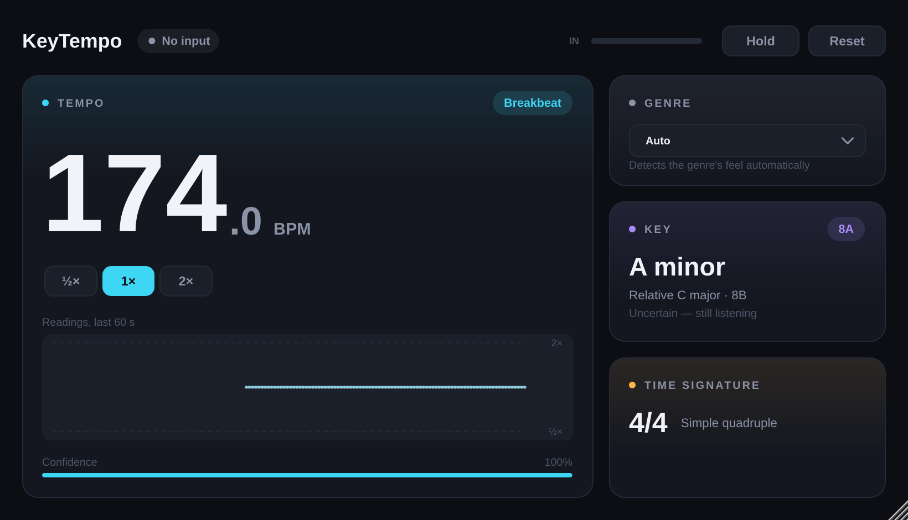

# KeyTempo



A tempo analyzer plug-in built for the music other BPM detectors get wrong: drum & bass,
jungle, dubstep, trap and rhythmically busy house and trance. It also shows the key
(with relative key and Camelot code) and time signature.

- **Tempo:** to ±0.05 BPM. It reads the groove (kick, snare and hat patterns), not just the
  pulse, to choose between 87 and 174, 70 and 140, or 116 and 174.
- **Genre:** Auto by default. Pick a genre to lock in DJ conventions (e.g. DnB is always
  read at 150–190).
- **Readings history:** 60 seconds of what each analysis window heard. Dots off the line
  show where the music was ambiguous.
- **Key** with relative key and Camelot code, plus **time signature** (4/4, 3/4, 6/8, 9/8).

Audio passes through untouched. Analysis runs on a background thread (~4% of one core),
never on the audio thread.

| Format     | Windows | macOS | Linux |
|------------|:-------:|:-----:|:-----:|
| VST3       | ✓ | ✓ | ✓ |
| CLAP       | ✓ | ✓ | ✓ |
| AU         |   | ✓ |   |
| LV2        | ✓ | ✓ | ✓ |
| Standalone | ✓ | ✓ | ✓ |
| AAX        | with the Avid SDK (see below) | | |

## Building

Requires CMake 3.22+ and a C++20 compiler (Visual Studio 2022, Xcode 15+, GCC 11+/Clang 14+).
JUCE 9 and the CLAP extensions are downloaded automatically.

```bash
cmake -S . -B build -DCMAKE_BUILD_TYPE=Release
cmake --build build --config Release --parallel
ctest --test-dir build -C Release        # analysis unit tests
```

Plug-ins land in `build/KeyTempo_artefacts/Release/<FORMAT>/`.

**Linux packages** (Ubuntu/Debian):
```bash
sudo apt install libasound2-dev libjack-jackd2-dev libfreetype-dev libfontconfig1-dev \
  libx11-dev libxcomposite-dev libxcursor-dev libxext-dev libxinerama-dev libxrandr-dev \
  libxrender-dev libxi-dev libglu1-mesa-dev mesa-common-dev libegl-dev
```

Useful options:

| Option | Effect |
|---|---|
| `-DKT_JUCE_PATH=/path/to/JUCE` | Use a local JUCE checkout instead of downloading |
| `-DKT_AAX_SDK_PATH=/path/to/aax-sdk` | Also build AAX (needs PACE signing to load in Pro Tools) |
| `-DKT_BUILD_PLUGIN=OFF` | Build/test only the analysis core (no JUCE, builds in seconds) |
| `-DKT_BUILD_TOOLS=ON` | Build `kt_tool` (below) |

Before releasing, change the identity block at the top of `CMakeLists.txt`
(company name, 4-character manufacturer and plug-in codes, bundle ID, LV2 URI).

### `kt_tool` — checking accuracy on real music

```bash
cmake -S . -B build -DKT_BUILD_TOOLS=ON && cmake --build build --target kt_tool
build/kt_tool_artefacts/Release/kt_tool analyze song1.wav song2.mp3 ...
build/kt_tool_artefacts/Release/kt_tool snapshot ui.png [song.wav]   # renders the editor
```

### CI

`.github/workflows/build.yml` builds on Windows, macOS (universal arm64/x86_64) and Linux, runs the
unit tests, validates the VST3 with pluginval (strictness 10) and the AU with `auval`, and uploads
zipped builds. Pushing a `v*` tag creates a draft GitHub release with all three zips.

## How it works

All analysis lives in `src/core/` — plain C++ with no JUCE dependency, so it is unit-tested on its own.

**Tempo** (`TempoDetector`, `GrooveModel`, `AnalysisEngine`)
1. *Onsets:* spectral-flux envelopes (~6 ms resolution) for the full mix plus three instrument
   bands: kick (< 110 Hz), snare/clap (mids × highs, which rejects synth stabs) and hats.
2. *Candidates:* autocorrelation over a 12 s window gives periodicity peaks. Each strong peak
   adds its 2×, ½×, 3:2 and 2:3 relatives, searched an octave beyond the genre range.
3. *Groove:* at each candidate tempo the bands are folded into one 16-step bar and matched
   against four-on-the-floor, backbeat and half-time templates, weighted by where those feels
   live (four-on-the-floor 112–152, backbeat with snare on 2 & 4 up to ~186, half-time
   dubstep/trap 128–160). At half the true tempo a DnB snare lands on 8th-note offbeats,
   which no template accepts. At double tempo the hats leave the offbeats empty. Either way
   the wrong reading loses. For busy grooves no template fits (rolling DnB with a ride on
   beat 3), *grid alignment* decides: at the true tempo the kick, snare and hats land on the
   8th-note grid. At a 3:2 reading they smear, and at half tempo they fall on in-between 16ths.
4. *Precision:* the winner is phase-locked to the onsets over the last 30 s (~0.01 BPM), and the
   shown value is the weighted median of recent readings, so a stray reading can't move it.
5. *Memory:* every 0.4 s reading adds evidence to its tempo, weighted by confidence, groove
   fit and how much kick is present compared with the track's drops. So intros, breakdowns
   and build-up snare rolls barely count, and the reading firms up over the track (90 s memory).

**Time signature** — With the beat known, a kick/bass-band envelope shows whether the bar repeats every
2/4 beats or every 3, and the full-band envelope shows whether beats divide in two (simple) or three
(compound). Evidence is averaged over several seconds before a meter is shown.

**Key** (`KeyDetector`) — A ~370 ms FFT with spectral peak picking builds a 12-note chromagram (65 Hz–2 kHz),
corrected for the track's tuning so A=432 material still works. The time-averaged chroma is correlated
against 24 key profiles (Sha'ath/KeyFinder profiles), and a separate bass chroma favours keys whose
tonic the bass keeps returning to — that's what separates a minor key from its relative major.

## Controls

- **Genre:** Auto, House / Techno (105–152), Trance (120–155), Drum & Bass / Jungle (150–190),
  Dubstep / Trap (125–160), Hip-Hop / R&B (60–115), Pop / Rock / Other (60–200). A genre
  narrows the range and the grooves considered, and anything outside the range is folded
  into it (a DnB track under Hip-Hop reads 87, never an unrelated 116).
- **½× / 1× / 2×:** show the tempo halved or doubled, if you count it differently.
- **Hold** freezes the readings. **Reset** forgets everything heard so far (use it between tracks).

## Testing tempo accuracy

`tests/bench/GrooveLab.h` synthesises 40-bar tracks (intro, main, breakdown, drop) in 15 styles:
house, tech house, trance, prog with dotted-8th percussion, techno with 3-step loops, DnB
two-step, amen/jungle, neurofunk, liquid, halftime DnB, dubstep, trap, boom bap, UK garage and
pop/rock, at their typical tempos (63 clips). `--hard` adds dotted-8th delays, reverb, triplet
percussion, snare-roll build-ups and dropped kicks.

```bash
cmake -S . -B build-core -DKT_BUILD_PLUGIN=OFF && cmake --build build-core
build-core/kt_tempo_bench                 # Auto
build-core/kt_tempo_bench --hard --genre  # hard mode, also with genre presets
build-core/kt_tempo_bench --wav out/      # write the clips to listen to
```

| | Correct at end | Correct from 12 s on |
|---|---|---|
| v0.1 (Auto) | 39 / 63 | 56% |
| v0.2 (Auto) | 63 / 63 | 99% |
| v0.2 (Auto, hard) | 63 / 63 | 98% |
| v0.3 (Auto, hard, +3 rolling-DnB 3:2 clips) | 66 / 66 | 99% |

Synthetic clips only prove the logic works; real tracks are the real test. On ten DnB and
trance tracks that other analyzers get wrong (Beatport lists every DnB one at half tempo),
KeyTempo is 10 / 10 in Auto, within 0.02 BPM. See [tests/REAL_TRACKS.md](tests/REAL_TRACKS.md).
`kt_tool analyze --trace --genre auto "song [174].mp3"` prints what the plug-in would show
over time (a `[174]` in the file name scores it).

## Known limitations

- Halftime DnB (snare only on beat 3 at 170–175) reads as 85–87 in Auto, the same as a hip-hop
  backbeat. A DnB track with a half-time intro shows 85–87 until the full-tempo drums come in.
  Choose the Drum & Bass genre to read it at 170–175 from the start.
- Tracks with no drums at all fall back to plain periodicity and are less reliable.
  Confidence drops to show it.
- Tempo changes within a track (DJ mixes, live recordings) are followed, but slowly, because
  of the 90 s memory. Press Reset when the track changes.
- Key: relative major/minor is the hardest call. If a song never leans on its tonic, the
  relative key may be shown.
- Time signature covers 4/4, 3/4, 6/8 and 9/8. Odd meters (5/4, 7/8) aren't detected yet.
- Builds are unsigned. On macOS, Gatekeeper may block them until you run
  `xattr -dr com.apple.quarantine <plugin>` or sign/notarize them.

## Licensing note

JUCE 8 and later is dual-licensed under AGPLv3 or a commercial JUCE licence (there is a free tier
for small developers). If you distribute closed-source builds you need the commercial licence.
CLAP and the clap-juce-extensions are MIT-licensed. AAX requires a free Avid developer account and
PACE signing.

## Project layout

```
src/core/      analysis engine (no JUCE): FFT, tempo + groove model, meter, key, music theory
src/plugin/    JUCE processor, editor and look-and-feel
tests/         unit tests, tempo benchmark (TempoBench.cpp) and the GrooveLab track generator
tools/         kt_tool: offline analyzer and UI snapshot
```
